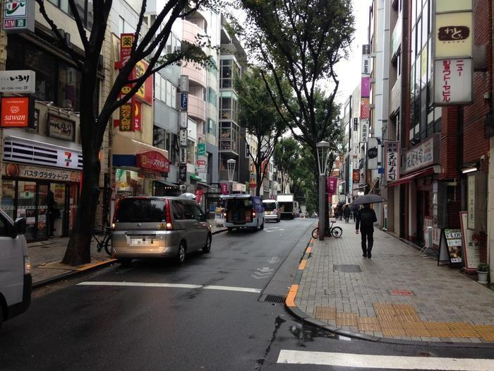
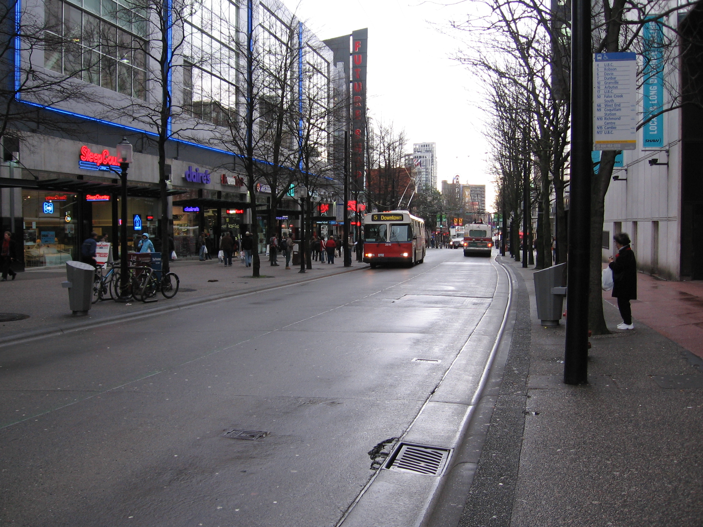
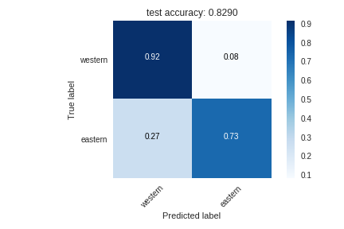
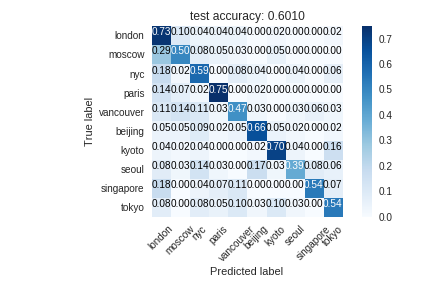
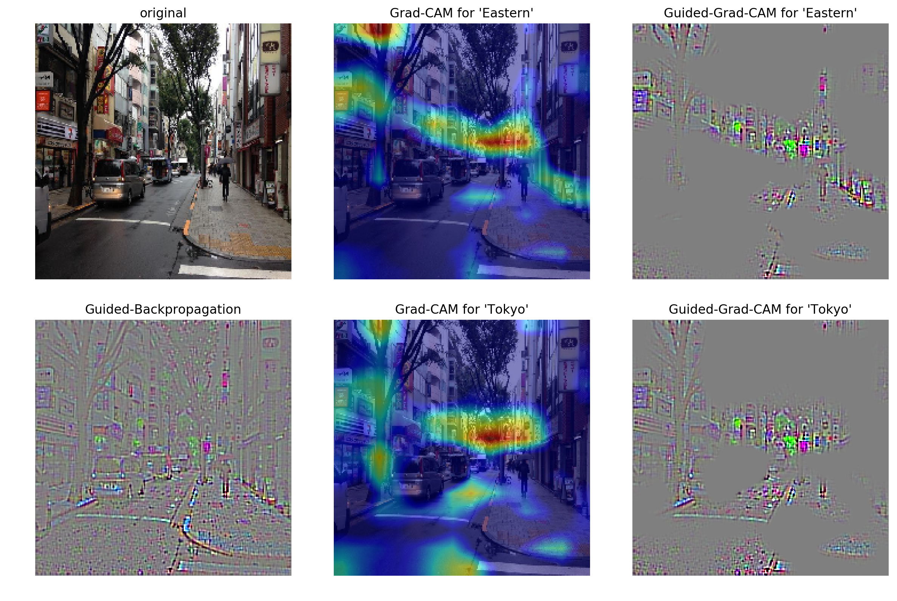
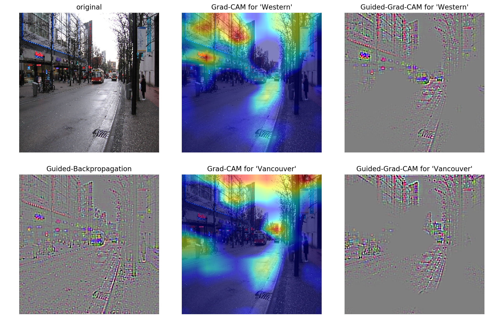

  
  
  
# VGG16-Street10 - Street-Feature Analysis with Keras
  
  
## TOC
  
  
  
  
  
* [About](#about )
* [What is possible with VGG16-Street10 ?](#what-is-possible-with-vgg16-street10 )
	* [Background](#background )
	* [Methods and details](#methods-and-details )
	* [Overview of results](#overview-of-results )
* [How to use](#how-to-use )
	* [Set-up](#set-up )
	* [Street classifying and Street-feature analysis](#street-classifying-and-street-feature-analysis )
	* [Use Street10](#use-street10 )
	* [Re-run jupyter notebooks on Colaboratory with GPU](#re-run-jupyter-notebooks-on-colaboratory-with-gpu )
* [Directories & files](#directories-files )
* [Questions](#questions )
* [Future works](#future-works )
* [Acknowledgements](#acknowledgements )
	* [References](#references )
* [Author](#author )
* [Appendix](#appendix )
  
  
  
  
  
  
## About
  
  
  
[VGG16-Street10] classifies "streets" of the 10 famous cities in the world, and also can be used for **"street-feature analysis"**.
  
This repository mainly contains 3 big parts below.
  
1. **Dataset**:
    - Scripts collecting and preprocessing "streets" images of the 10 cities in the world
    - [The link](#use-street10 ) to the dataset itself called Street10, created specially for this project
2. **Street classifier**:
    - Jupyter-notebooks (and scripts used in them) for training and testing various CNNs
    - [VGG16-Street10], CNN that achieved the best classification results
3. **Street-feature analyzer**:
    - [Comamnd-line program](run.py ) that takes street images as input and classifies them and visualizing their characteristic "features"
  
  
  
## What is possible with VGG16-Street10 ?
  
  
  
### Background
  
  
Haven't you ever felt "the atmosphere of a city" when seeing its street ? (Recall when you get back to your mother town after a long journey in foreign countries ...)
  
For example, even though the two images below seems rather similar, but they must invoke really different impressions for those who have ever lived both in Tokyo and Vancouver (at least very different for me).
  
| Tokyo                                                           | Vancouver                                                               |
|-----------------------------------------------------------------|-------------------------------------------------------------------------|
|  |  |
  
(Images are downloaded via [Google Image Search] with usage right labeled for `noncommercial reuse with modification`)
  
So, what's the difference ? What makes the left more "Tokyo-like" and the right "Vancouver-ish" ? These're why I decided to launch this project.
  
  
### Methods and details
  
  
1. **Dataset**
  
    - How created
        - Collecting street images with its location labelled: [Google Image Search] & [icrawler]
            - e.g.) Collect street images of Tokyo with search-keywords: *"Tokyo street -fashion -food -painting -art -graffiti"*
            - **with [`GoogleImageCrawler(filter={license=noncommercial,modify})`](https://icrawler.readthedocs.io/en/latest/builtin.html#search-engine-crawlers ) in order to only collect images labeled for noncommercial reuse with modifications**
        - Preprocessing: Remove duplicates, cropping margins
        - Selection: **Author's visual judgement** of removing images that seem incorrectly labeled or not suit to the concepts of "street" in this project
            - Yes, this process must be a lot problematic. See [Questions](##Questions ) section below
  
    - Details of dataset: Street10
        - Total number of images: 4,151
        - Data format: .npy file (zipped 748 MB), including array of 224 x 224 x 3 size images each
        - Class list: Western/Eastern, 10 cities: the number of samples
            - Eastern: 1997 images
                - Beijing: 434 images
                - Kyoto: 553 images
                - Seoul: 353 images
                - Singapore: 275 images
                - Tokyo: 382 images
            - Western: 2154 images
                - London: 482 images
                - Moscow: 379 images
                - NYC: 503 images
                - Paris: 436 images
                - Vancouver: 354 images
  
2. **Street Classifier**
  
    - How to train
        - Transfer-learning & Fine-tuning of [VGG16-Places365] (VGG16-architecture CNN trained on [Places-Dataset])
            - Compared: Baselines(SVM on extracted deep-features of the last layer of [VGG16-Places365]), [ImageNet] pre-trained CNN, Randomly-initialized network
        - Computation resources: GPUs offered within [Google Colaboratory][colaboratory]
  
    - Details of [VGG16-Street10] : 
        - Fine-tuned CNN of [VGG16-Places365]
        - Trained layers: The final dense layers & The last convolutional block
        - Params
            - Trained: 7,410,572
            - Non-trained: 7,636,544
        - Outputs
            - Output1: "Eastern or Western classification" (binary class)
            - Output2: "City classification" (10 classes)
        - File type: .h5 file (Keras-format)        
  
3. **Street-feature analyzer**
  
    - Method: [(Guided-)GradCAM] (Attribution analysis)
  
    - We can interpret the objects and structures in the highly-attributed (salient) area of an input image by the method as *distinctive elements of the street*, which are important for the CNN to make the prediction
  
  
  
### Overview of results
  
  
- Classification metrics (accuracy and normalized confusion matrix) against whole 421 test samples
  
| Output 1: Eastern/Western classification                                                    | Output 2: 10 cities classification                                                            |
|---------------------------------------------------------------------------------------------|---------------------------------------------------------------------------------------------|
|  |  |
  
- Results against the example images shown above
  
|                         | Tokyo                                                                                                                                                                                                           | Vancouver                                                                                                                                                                                                      |
|:-----------------------:|:----------------------------------------------------------------------------------------------------------------------------------------------------------------------------------------------------------------|:---------------------------------------------------------------------------------------------------------------------------------------------------------------------------------------------------------------|
|     Classification      | `[Process 1]: Prediction 1 `<br>` - Eastern: 78.714 %`<br>` - Western: 21.286 %`<br>`[Process 1]: Prediction 2 for top 3 cities`<br>*` - Tokyo  : 80.814 %`*<br>` - Kyoto  : 12.945 %`<br>` - London : 3.568 %` | `[Process 2]: Prediction 1`<br>` - Western: 99.856 %`<br>` - Eastern: 0.144 %`<br>`[Process 2]: Prediction 2 for top 3 cities`<br>*` - Vancouver: 94.909 %`*<br>` - NYC    : 4.815 %`<br>` - London : 0.166 %` |   |
| Street-feature analysis |                                                                                                                                      |                                                                                                                             |
  
As for the two images above, [VGG16-Street10] could make good predictions ! <br> And from the Guided-GradCAM results, we could do "street-feature analysis" like ...
  
- Tokyo street has
    - crowded objects
    - a lot of advertising displays
    - narrow road
- Vancouver street has 
    - more open space with larger sky
    - characteristic trash box like stuffs
    - wider road
  
I think this kind of analysis can be useful in city development or landscape conservation or so. <br> (Not satisfied just with this samplewise analysis ? See [Questions](#questions ) and [Future works](#future-works ) sections for the other ideas)
  
  
  
## How to use
  
  
### Set-up
  
  
1. First you have to make Git, Python and the libraries below available on your machine. My versions are shown after colons.
    - [Python](https://www.python.org/ ): `sys.version == '3.6.5 |Anaconda custom (64-bit)| (default, Mar 29 2018, 13:32:41) [MSC v.1900 64 bit (AMD64)]'`
    - [Numpy](http://www.numpy.org/ ): `numpy.__version__ == '1.14.3'`
    - [Matplotlib](https://matplotlib.org/ ): `matplotlib.__version__ == '2.2.2'`
    - [OpenCV](https://opencv-python-tutroals.readthedocs.io/en/latest/ ): `cv2.__version__ == '3.4.1'`
    - [TensorFlow](https://www.tensorflow.org/ ): `tensorflow.__version__ == 1.10.0`
    - [Keras](https://keras.io/ ): `keras.__version__ == '2.2.2'`
2. Clone this repository: `git clone https://github.com/aviatesk/street-feature-analysis.git`
    - Via SSH: `git clone git@github.com:aviatesk/street-feature-analysis.git`
3. Run [run.py] and check if the demo works successfully: `python run.py`
  
  
### Street classifying and Street-feature analysis
  
  
Now you can classify and analyze any .jpg or .png format street image you want. For example, you can re-produce [the results above](#overview-of-results ) with this command.
  
```sh
python run.py assets/tokyo.jpg assets/vancouver.jpg
```
  
[run.py] also can take online images with their url given (Guided-backpropagation is disabled with online images by default).
  
```sh
python run.py https://wiki.samurai-archives.com/images/b/b9/Shinmachi-nishikikoji.jpg
```
  
If you want to only see GradCAM results, your can use `--only-cam` option.
  
```sh
python run.py --only-cam assets/tokyo.jpg assets/vancouver.jpg
```
  
Run `python run.py -h` to see the details about the other options.
  
  
### Use Street10
  
  
You can get Street10 at this link: **https://drive.google.com/file/d/1qOIKSr2LA9TbBYf96y1Wr0KrQKBGmHQp/view?usp=sharing** (anyone who knows this link can download it). <br> Unzip Street10.zip and then you would get .npy files each of which keeps each city's street images as an n x 224 x 224 x 3 array.
  
You may find [load_data.py](src/load_data.py ) useful to load and see the data, or to convert the data into .png format and make the directory for using `keras.preprocessing.image.ImageDataGenerator.flow_from_directory`.
  
  
### Re-run jupyter notebooks on Colaboratory with GPU
  
  
If you want to re-run jupyter-notebooks in [notebooks](notebooks ) directory, that train and test [VGG16-Street10] and the many alternative models, you should follow the steps below.
  
1. Make [Google Drive](https://www.google.com/drive/ ) available with your Google account
2. Move this repository directory under your `My Drive` (Upload from browser or via [Backup and Sync from Google](https://www.google.com/drive/download/backup-and-sync/ ))
3. Change the name of the directory from `street-feature-analysis` (original) to `prj`
4. Move and rename [`Street10`](#use-street10 ) to `prj/data/processed/processed_data.zip`
4. Open `prj/notebooks/notebooks.ipynb` within [Colaboratory] and run code cells with turning its GPU on
  
  
  
## Directories & files
  
  
For those interested in details, here are brief descriptions for directories and files in this repository.
  
- [assets](assets ): Files used for this document
- [data](data ): 
    - [downloaded](data/demo_downloaded ): Images downloaded by [run.py]
- [figs](figs ): Figures showing results of various models I tried
- [hists](hists ): .csv files showing the learning transitions of various CNNs I tried
- [models](models ):
    - [512-avg-0.5vs1-15.best.default.h5](512-avg-0.5vs1-15.best.default.h5 ): Keras-format model .h5 file a.k.a. [VGG16-Street10]
- [notebooks](notebooks ): Jupyter-notebooks for training and testing various models on [Colaboratory] with GPUs.
- [presentation-2018-12-14](presentation-2018-12-14 ): Documents of the presentations I held on Dec.14, 2018, at University of Tokyo
- [results](results ): Results from [run.py]
    - Also containing batchwisely-computed results (see [Appendix](#appendix ) section)
- [src](src ): Scripts for collecting/processing data and supporting running [notebooks](notebooks )
    - [places365_vgg16_keras](src/places365_vgg16_keras ): Loads [VGG16-Places365] (originally cloned from https://github.com/GKalliatakis/Keras-VGG16-places365)
    - [callbacks.py](src/callbacks.py ): Defines `keras.callbacks.Callback` objects to be called while traning networks
    - [crawl.py](src/crawl.py ): Crawls images via [Google Image Search] with [icrawler]
    - [extract.py](src/extract.py ): Extracts deep-features for SVM-based baselines
    - [guided_grad_cam.py](src/guided_grad_cam.py ): Computes [(Guided-)GradCAM] for [run.py]
    - [load_data.py](src/load_data.py ): Loads and set training/validation/test data
    - [load_model.py](src/load_model.py ): Loads and set transfered/fine-tuned networks of [VGG16-Places365] or VGG16-ImageNet
    - [preprocess.py](src/preprocess.py ): Preprocesses the crawlled data by [crawl.py](src/crawl.py )
    - [set_generator.py](src/set_generator.py ): Defines `keras.preprocessing.image.ImageDataGenerator` class objects for using `flow_from_directory` method with multiple outputs
    - [utils.py](src/utils.py ): Defines utility functions
  
  
  
## Questions
  
  
Here are two big possible questions you may have about this project and my answers for them.
  
1. To what extent can I trust the dataset Street10 ?
    - Unfortunately, the quality of Street10 may not be too high, mainly in terms of its accuracy or consistency. There are two main reasons for this. One is that I could not completely confirm a street is *really* in the city while my own visual judgement. Second is because the concept of "street" in this project is actually ambiguous, e.g. we can't easily tell the difference between "street" and "building", or "road".
    - In conclusion, I don't recommend you to use Street10 for your project without any double-checking or modification.
  
2. Is attribution analysis reliable ? Is "street-feature analysis" from [VGG16-Street10] trustworthy ?
    - Some recent research throws fundamental doubts on the reliability of saliency methods including [(Guided-)GradCAM]: https://arxiv.org/pdf/1711.00867.pdf. Even worse, [(Guided-)GradCAM] is actually *not* enough for "street-feature analysis" in the first place, mainly because it only shows samplewise-attribution for an input image and can't detect *the universal features* across the whole dataset.
    - Research for the interpretability of CNNs' deep features is on-going, and likewise "street-feature analysis" needs more enhancements as well.
    - From all above, I must say "street-feature analysis" is still in prototype and not applicable to practical usage for now.
  
If you have any more comment or suggestion for this project, you're welcom to open an issue or make a pull request !
  
  
  
## Future works
  
  
While there are many on-going researchs about the interpretability of neural networks' behaviour including Attribution analysis like [(Guided-)GradCAM], it seems that an interface combining Feature visulalization with Attribution analysis introduced in https://distill.pub/2018/building-blocks/ could be the next step. I may implement the rich interface for [VGG16-Street10] as a future enhancement.
  
  
  
## Acknowledgements
  
  
This project is carried as the final assignment for [DL4US](http://dl4us.com/ ), online deep-learning educating course held by [Matsuo Lab., the University of Tokyo](https://weblab.t.u-tokyo.ac.jp/en/ ). Though almost all what I have done with the project is accessible within this repository, only the final report I submitted is not available because of restriction. But still you can see the [slides of presentation](presentation-2018-12-14/presentation-2018-12-14.pdf ) that I held at the completion celemony on Dec.14, 2018, at University of Tokyo (in Japanese).
  
The initial inspiration for this project was from my friend [Ryohei](https://www.instagram.com/ryohei_ideal/ )'s instagram post: https://www.instagram.com/p/Bl7Sd2dnwNt8ZVzTu1Rdbe0NPUayQY48K77u-k0/ <br> Check his cool posts with great implications !
  
  
### References
  
  
While developing this project, I referred to many online resources. I show the main references list below. Thanks for all the great authors !
  
- Places Dataset by B. Zhou, A. Lapedriza, A. Khosla, A. Oliva, and A. Torralba: http://places2.csail.mit.edu/
- VGG16-Places365: https://github.com/CSAILVision/places365
    - Converted to Keras format model by [GKalliatakis](https://github.com/GKalliatakis ): https://github.com/GKalliatakis/Keras-VGG16-places365
- (Guided-)GradCAM by Ramprasaath R. Selvaraju, Michael Cogswell, Abhishek Das, Ramakrishna Vedantam, Devi Parikh, Dhruv Batra: https://arxiv.org/abs/1610.02391
    - Referred to Keras implementation by [jacobgil](https://github.com/jacobgil ): https://github.com/jacobgil/keras-grad-cam
  
  
  
## Author
  
  
- **KADOWAKI, Shuhei** - *Undergraduate@Kyoto Univ.* - [aviatesk]
  
  
  
## Appendix
  
  
Here are batchwisely-computed classification and attribution results for examples in each city (original input images on the upper rows and results on the lower - classification results shown in the title position).
  
- Eastern cities
  

  
- Western cities
  

  
  
  
  
  
  
[aviatesk]: https://github.com/aviatesk
[VGG16-Street10]: models/512-avg-0.5vs1-15.best.demo-default.h5
[run.py]: run.py
[Google Image Search]: https://images.google.com/
[icrawler]: https://icrawler.readthedocs.io/en/latest/
[VGG16-Places365]: https://github.com/CSAILVision/places365
[Places-Dataset]: http://places2.csail.mit.edu/
[(Guided-)GradCAM]: https://arxiv.org/abs/1610.02391
[Colaboratory]: https://colab.research.google.com/notebooks/welcome.ipynb#recent=true
[ImageNet]: http://www.image-net.org/
[Keras-VGG16-places365]: https://github.com/GKalliatakis/Keras-VGG16-places365
[keras-grad-cam]: https://github.com/jacobgil/keras-grad-cam
  